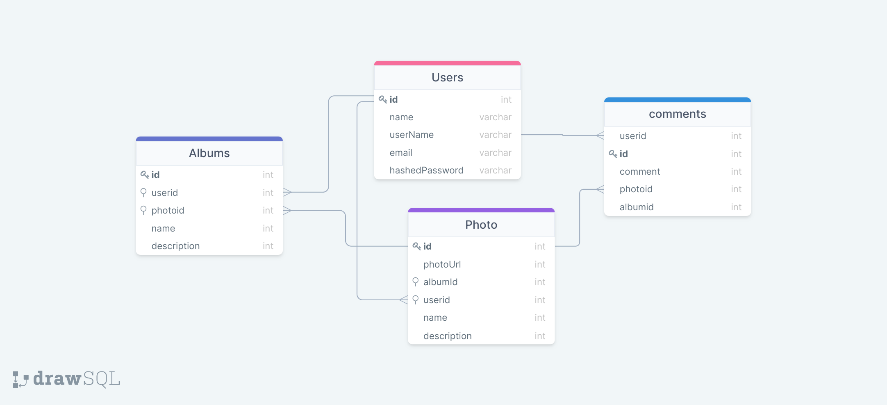

# Clickr Application

## About

Clickr is Flickr clone that allows users to publish their own photos, create albums, comment and tag other user's photos that interest them.
Built using React, Redux for the frontend and Express, PostgreSQL + Sequelize for the backend

## Features

1. User authentication:
    - Sign-in and Sign-up
    - Sign-in as a Demo User

    --splash page
    --Photo Feed
    --single photo page
    --upload/delete photo

    bonus
    --my photo page
    --comments 
    --tags

2. splash Page
    - Sign-in and Sign-up
    - Sign-in as a Demo User
  
2. Photos:
    - Users should be able to create photos
    - Users should be able to update photos
    - Users should be able to upload photos
    - Users should be able to delete photos

<!-- 2. Albums:
    - Users should be able to create Albums
    - Users should be able to update Albums
    - Users should be able to upload Albums
    - Users should be able to delete Albums -->

2. Comments:
    - Users should be able to create Comments
    - Users should be able to update Comments
    - Users should be able to upload Comments
    - Users should be able to delete Comments

2. Tags:
    - Users should be able to create photos
    - Users should be able to update photos
    - Users should be able to upload photos
    - Users should be able to delete photos

Bonus

1. Favorites

2. Follows

## Database Schema

